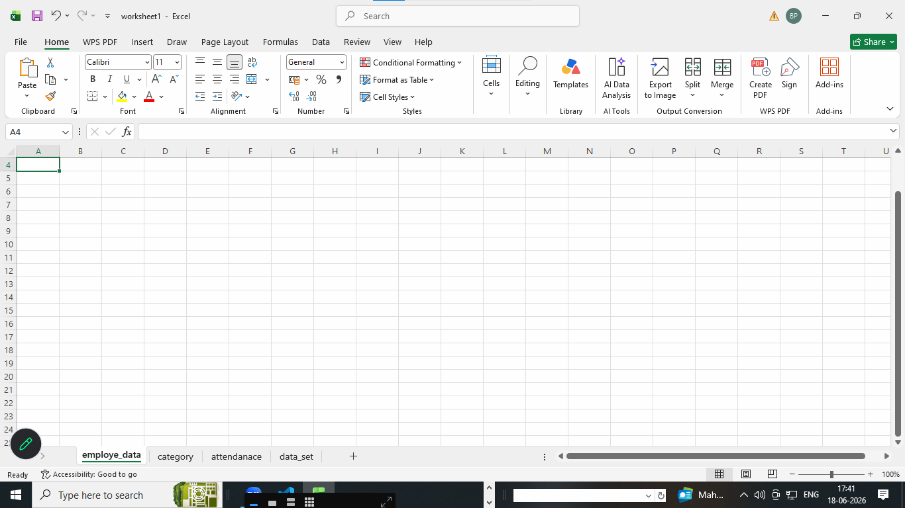
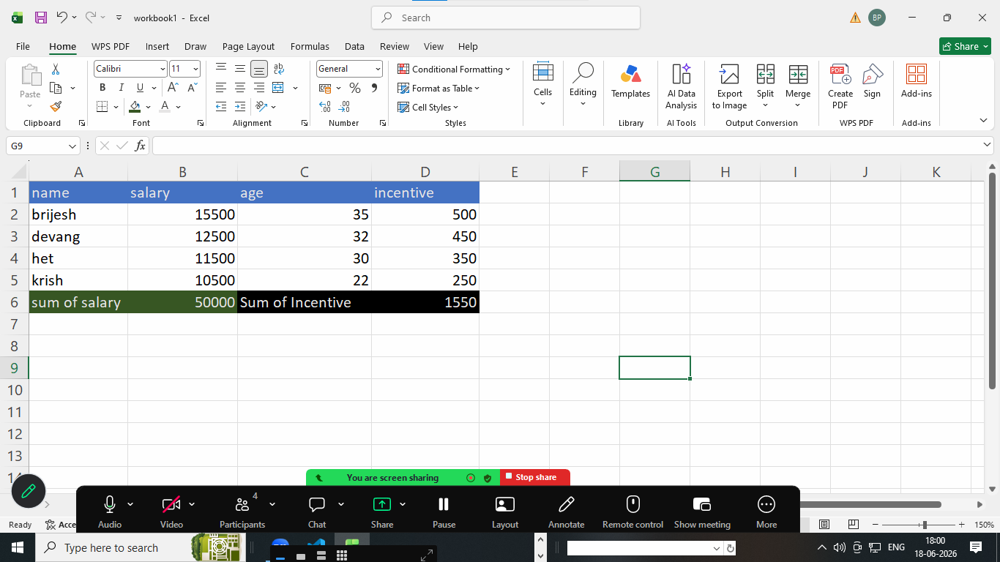
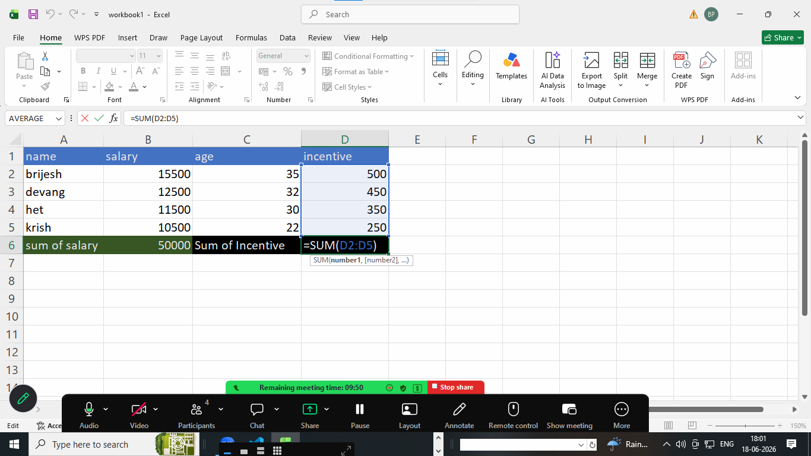
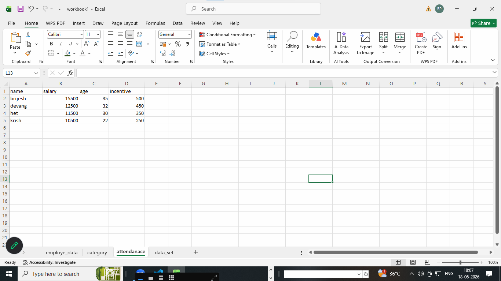
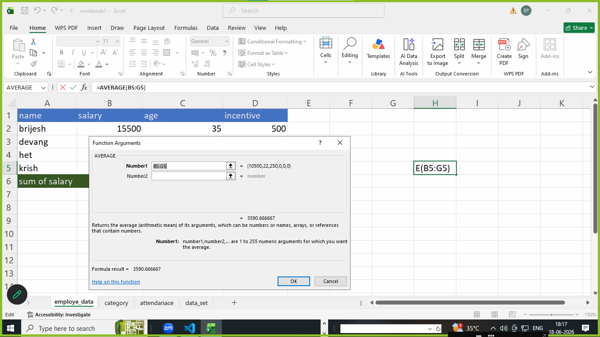

# what is excel in DA explain Excel? 

1. excel is an application software 
2. excel basically create  workbook
3. excel files extension 
 
examples : workbook1.xlsx

**screenshot**

3. excel create multiple sheet inside of any worksheet

examples : create a multiple sheet or worksheet

4. rows an workbook1.xlsx 

rows(1,2,3,4,5) verticle data 

5. columns an workbook1.xlsx 

columns(A,B,C,D) horizontal data display          

6. cell : cell is intersection of rows and columns

examples : cell(A1:A5)

7. basic formula in excels is calculated by with "="

8. Function in excel : inbuilt function provided in excel such as 

examples : sum() , avg() , min() , max(), index(), vlookup() , textlookup(), match() etc 

9. Range : A group of adjacent cells for examples : cell(A1:B5)
                        cell(A2:B5)

# basic interface related in excel

**structures o basic interface**

1. ribbon : The toolbar of excel located at top with tabs such as Home | insert | page layout | formulas | data | Reviews | View | Help

2. Name Box: shows the active cell references
examples : A1 | B1 | C1 | D1 

3. formula BAR : displays or edits the active cell formula or value

examples : "="

  

4. status BAR : shows information like sum , average , count of selected cell 

examples :  

  

5. sheet tabs : switch between worksheet at the bottom of excel

     

# Microsoft Excel: Common Features and Shortcuts

## Common Features of Microsoft Excel

| Feature | Description | Example |
|---------|-------------|---------|
| Worksheets | Organize data into multiple sheets within a workbook. | Sheet1 for Sales, Sheet2 for Expenses |
| Cells | Individual boxes where data is entered. | A1 = "Name", B1 = "Salary" |
| Formulas | Perform calculations using formulas. | `=A1+B1` |
| Functions | Built-in formulas for common calculations. | `=SUM(A1:A10)` |
| Charts | Create visual representations of data. | Bar Chart, Pie Chart, Line Chart |
| Sorting | Arrange data in ascending or descending order. | Sort names A–Z |
| Filtering | Display only data matching specific criteria. | Show only "Completed" tasks |
| Conditional Formatting | Highlight cells based on conditions. | Color scores above 80 in green |
| Pivot Tables | Summarize and analyze large datasets. | Sales by Region |
| Data Validation | Restrict allowed input values. | Dropdown list for Departments |
| Freeze Panes | Keep rows or columns visible while scrolling. | Freeze the header row |
| AutoFill | Automatically fill patterns or formulas. | Drag to fill dates or numbers |
| Find & Replace | Search and replace text or values. | Replace "USA" with "United States" |
| Tables | Convert ranges into structured tables. | `Ctrl + T` |
| Cell Formatting | Change font, color, borders, and number format. | Currency, Percentage, Date |

---

# Common Excel Keyboard Shortcuts

| Shortcut | Action | Example |
|----------|--------|---------|
| `Ctrl + N` | Create a new workbook | Open a blank Excel file |
| `Ctrl + O` | Open an existing workbook | Open `Sales.xlsx` |
| `Ctrl + S` | Save workbook | Save current file |
| `Ctrl + P` | Print workbook | Print worksheet |
| `Ctrl + C` | Copy selected cells | Copy A1:A5 |
| `Ctrl + X` | Cut selected cells | Move data |
| `Ctrl + V` | Paste copied cells | Paste into B1 |
| `Ctrl + Z` | Undo last action | Undo deletion |
| `Ctrl + Y` | Redo last action | Restore undone action |
| `Ctrl + A` | Select all cells | Select entire worksheet |
| `Ctrl + F` | Find text or numbers | Find "John" |
| `Ctrl + H` | Find and Replace | Replace "Jan" with "January" |
| `Ctrl + B` | Bold text | Make headings bold |
| `Ctrl + I` | Italic text | Italicize title |
| `Ctrl + U` | Underline text | Underline headings |
| `Ctrl + 1` | Open Format Cells dialog | Change number format |
| `Ctrl + T` | Create a table | Convert data range to a table |
| `Ctrl + Shift + L` | Toggle filters | Add or remove filters |
| `Alt + =` | AutoSum | Sum a column of numbers |
| `F2` | Edit active cell | Modify cell A1 |
| `F4` | Repeat last action or toggle absolute references | Change `A1` to `$A$1` in a formula |
| `Ctrl + Arrow Key` | Jump to edge of data | Move to last filled cell |
| `Ctrl + Shift + Arrow Key` | Select data to edge | Select an entire column of data |
| `Ctrl + Home` | Go to beginning of worksheet | Move to cell A1 |
| `Ctrl + End` | Go to last used cell | Jump to last data cell |
| `Ctrl + Page Up` | Previous worksheet | Switch to previous sheet |
| `Ctrl + Page Down` | Next worksheet | Switch to next sheet |
| `Ctrl + ;` | Insert current date | Enter today's date |
| `Ctrl + Shift + ;` | Insert current time | Enter current time |
| `Ctrl + D` | Fill down | Copy value/formula downward |
| `Ctrl + R` | Fill right | Copy value/formula to the right |
| `Ctrl + Space` | Select entire column | Select column B |
| `Shift + Space` | Select entire row | Select row 5 |
| `Alt + Enter` | New line within a cell | Write multiple lines in one cell |

---

## Example Formulas

| Formula | Purpose | Example Result |
|----------|---------|----------------|
| `=SUM(A1:A5)` | Add numbers | Total of A1 to A5 |
| `=AVERAGE(A1:A5)` | Calculate average | Mean value |
| `=MAX(A1:A5)` | Largest value | Highest score |
| `=MIN(A1:A5)` | Smallest value | Lowest score |
| `=COUNT(A1:A5)` | Count numeric cells | Number of values |
| `=IF(A1>=50,"Pass","Fail")` | Logical test | Pass or Fail |
| `=CONCAT(A1," ",B1)` | Join text | Full name |
| `=TODAY()` | Current date | Today's date |
| `=NOW()` | Current date and time | Current timestamp |
| `=VLOOKUP(101,A2:D10,2,FALSE)` | Find matching value | Employee name |
| `=XLOOKUP(101,A2:A10,B2:B10)` | Modern lookup | Employee name |
